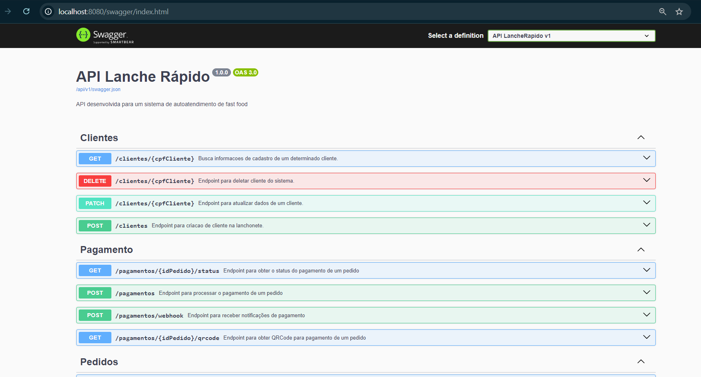

# techChallenge FIAP - G24 FASE 2

API desenvolvida para controle de pedidos de uma lanchonete utilizando Kubernetes e refatoração do código seguindo padrões clean code.


- Miro: [Dashboard Miro](https://miro.com/app/board/uXjVKQl5ank=/?share_link_id=2259608060)
- Vídeo: 


## Grupo 24 - Integrantes
💻 *<b>RM355456</b>*: Franciele de Jesus Zanella Ataulo </br>
💻 *<b>RM355476</b>*: Bruno Luis Begliomini Ataulo </br>
💻 *<b>RM355921</b>*: Cesar Pereira Moroni </br>


## Nome Discord:
Franciele RM 355456</br>
Bruno - RM355476</br>
Cesar P Moroni RM355921</br>

## Desenho da arquiterura

Desenho com detalhes da infraestrutura do software


Para executar esta solução, você deve entrar na pasta raíz e executar o comando:
```
docker-compose up
```
Esse comando irá ler o arquivo <b>docker-compose.yml</b> que está na mesma pasta e criar os containers da API e do Banco de Dados SQL.
</br>

</br>

 
</br>
<b>Como acessar</b>:
</br>
 
<b>API</b>: http://localhost:5000/swagger/index.html
</br>




No endpoint GET/pedidos, já existe alguns pedidos criados para testes</br>
Liste todos os pedidos realizadose escolha um idPedido com o status RECEBIDO.


</br>


## Obtenha o QRCode para pagamento do pedido no Mercado Pago.

Crie um pagamento para um pedido que esteja com o status RECEBIDO.


Obtenha o QRCode para pagamento do pedido no Mercado Pago.


Acesse o site https://www.qrcode-monkey.com/ e gere a imagem utilizando o QR Code obtido no campo qr_data. Na página, selecione a aba TEXT, cole o QR Code no campo Your Text e clique no botão Create QR Code para criar a imagem correspondente.


</br>
</br>

```
Servidor: localhost
Usuário: SA
Senha: Pa55w0rd2021
Base de Dados: LancheRapidoBD

```


